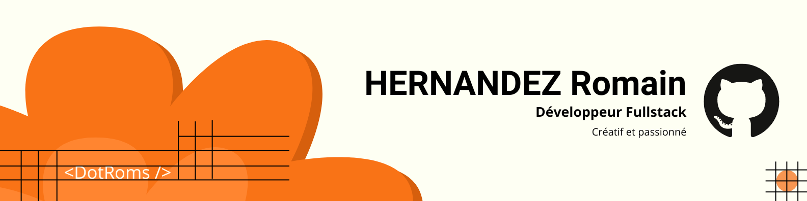

# Bienvenue sur mon profile Github 🙋‍♂️

### Je suis développeur web fullstack.

- **Je suis passionné** : Ma passion pour la technologie et la programmation est une source constante de motivation. Je m'engage dans l'exploration des dernières innovations et techniques pour rester à la pointe du développement et enrichir continuellement mes compétences. ✍️
  
- **Je suis créatif** : Mon expérience en design graphique me permet d'intégrer une dimension artistique dans mes projets de développement web. Je m'efforce de créer des interfaces utilisateur qui allient esthétique et fonctionnalité pour offrir des expériences captivantes et intuitives. 👨‍🎨

- **Je suis déterminé à faire évoluer les entreprises pour lesquelles je travaille** : Je suis dédié à aider les entreprises à transformer leurs opérations grâce à des solutions technologiques innovantes. En concevant des architectures robustes et en développant des solutions sur mesure, je vise à répondre aux besoins spécifiques des entreprises et à favoriser leur croissance et leur succès. 🫵

- **Je suis développeur** : Formé par une grande école du numérique, j'ai acquis une expertise approfondie dans le développement web full stack. Je maîtrise les principes fondamentaux du développement front-end et back-end, ainsi que les outils et pratiques avancés pour garantir la qualité et la robustesse des solutions que je crée. Mon approche inclut également l'utilisation de méthodes modernes de gestion de données et de tests pour assurer une performance optimale. 🧑‍💻

## Compétences techniques

### Technologies Frontend

### Technologies Backend

### Divers

